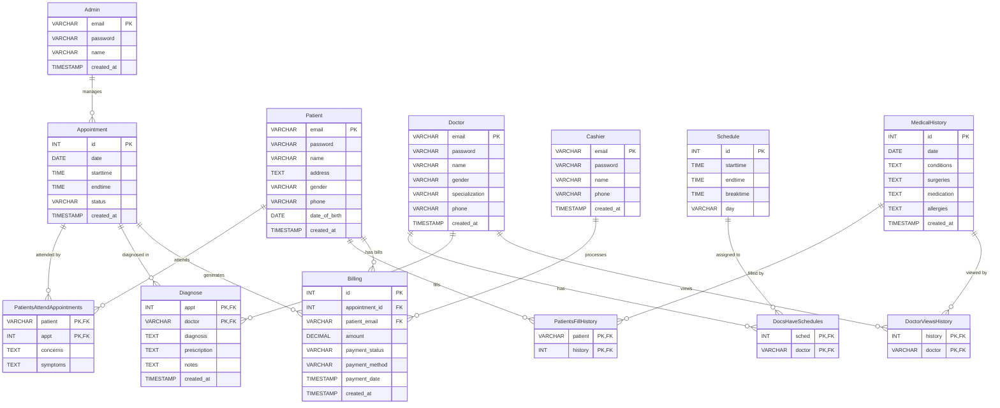

# Hospital Management System - ER Diagram

## Entity Relationship Diagram

## Entity Descriptions

### Core User Entities
- **Admin**: System administrators who manage users, appointments, and billing
- **Patient**: Patients who book appointments and maintain medical history
- **Doctor**: Medical professionals who diagnose patients and view medical history
- **Cashier**: Staff who process billing and payments

### Core Business Entities
- **Appointment**: Scheduled appointments between patients and doctors
- **Schedule**: Doctor availability schedules (time slots and days)
- **MedicalHistory**: Patient medical records including conditions, surgeries, medications, and allergies
- **Billing**: Payment records linked to appointments

### Relationship Entities (Junction Tables)
- **PatientsAttendAppointments**: Links patients to appointments with concerns and symptoms
- **PatientsFillHistory**: Links patients to their medical history records
- **DocsHaveSchedules**: Links doctors to their schedules
- **Diagnose**: Links doctors to appointments with diagnosis, prescription, and notes
- **DoctorViewsHistory**: Links doctors to medical history records they can view

## Relationship Cardinalities

1. **Patient ↔ Appointment**: Many-to-Many (via PatientsAttendAppointments)
   - One patient can have many appointments
   - One appointment can have one patient

2. **Patient ↔ MedicalHistory**: One-to-Many (via PatientsFillHistory)
   - One patient can have many medical history records
   - One medical history record belongs to one patient

3. **Doctor ↔ Schedule**: Many-to-Many (via DocsHaveSchedules)
   - One doctor can have many schedules
   - One schedule can belong to many doctors

4. **Doctor ↔ Appointment**: Many-to-Many (via Diagnose)
   - One doctor can diagnose many appointments
   - One appointment can be diagnosed by one doctor

5. **Doctor ↔ MedicalHistory**: Many-to-Many (via DoctorViewsHistory)
   - One doctor can view many medical history records
   - One medical history record can be viewed by many doctors

6. **Appointment ↔ Billing**: One-to-Many
   - One appointment can generate many bills
   - One bill belongs to one appointment

7. **Patient ↔ Billing**: One-to-Many
   - One patient can have many bills
   - One bill belongs to one patient

